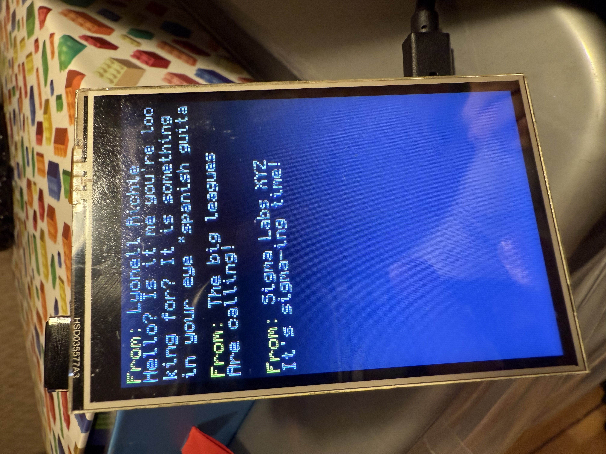

# Omar's poke-me tron 9000
## Intro-duction
So... this week I learned about the wonderful world of API backend development with Flask. Turns out its funner that I previously tought so I decided to make a fun lil' message board application on a rpi I had laying around and some screen I am driving through SPI commands.

*Is this overly complicated?*-yes
*Could my time have been better spent relaxing instead of going down this rabbit-hole?*-yes
*Did I have a ton of fun?*-ABSOLUTELY

## What does this do?
In essence this is a code repo for an rpi to get a message over the internet and display it on a screen I hooked up to it. Any of your messages will be shown to me or whoever happens to be in the same room (and actually bothers).

This is the device!



Not much else to it (for now). You can also run a GET on:
```
https://unmotorised-unphysiologically-nia.ngrok-free.dev/messages
```

if you are itching to see all the insightfull messages everyone else shared!

## How to use:

In essence, you send a HTTP POST request to:
```
https://unmotorised-unphysiologically-nia.ngrok-free.dev/messages
```

with a payload of:

```
{
    "from":"Lyonell Richie",
    "message" : "Hello? Is it me you're looking for?"
}
```

Please note that there's a 78 character limit on your message. Anything bigger than that just gets cropped.

If the message payload does not have "from" and "message" with correct format (should go without saying), the request will get rejected.

Likewise the name has a 21 character limit. It won't get rejected but it WILL get cropped and not show through the whole screen (...bummer).
